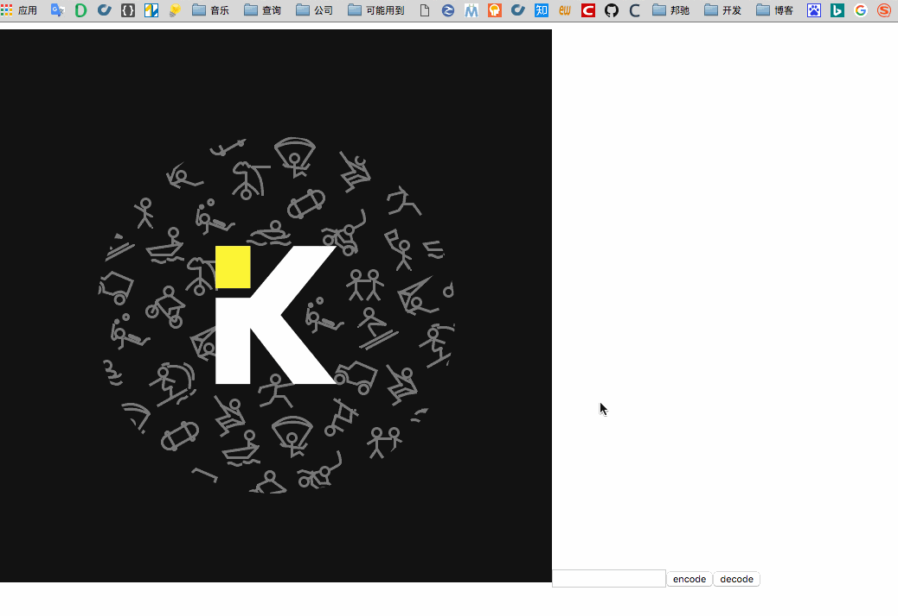

##隐写术

###功能
是不是有些话想说却开不了口?(用这个方法估计你还是开不了口)

把想说的话放入图片中，通过这样的一种方式交流 

其他人是不知道你在说什么的！ 

就像这样

###原理
图片是由很多像素组成的，每个像素是RGB的色值，R、G、B分别为该像素的红、绿、蓝通道，每个通道的分量值范围在0~255，对一个像素的RGB数值进行细微更改，比如将R通道的123改变成124，是看不出来细微的变化的，但是数据却可以因此冗余在图片中

###待改进

1. 加入密钥的概念，除了被加密文字，还可以持有密钥一起加密，其他人不易破解
2. 可以改成图片上传模式，进行在线的加解密